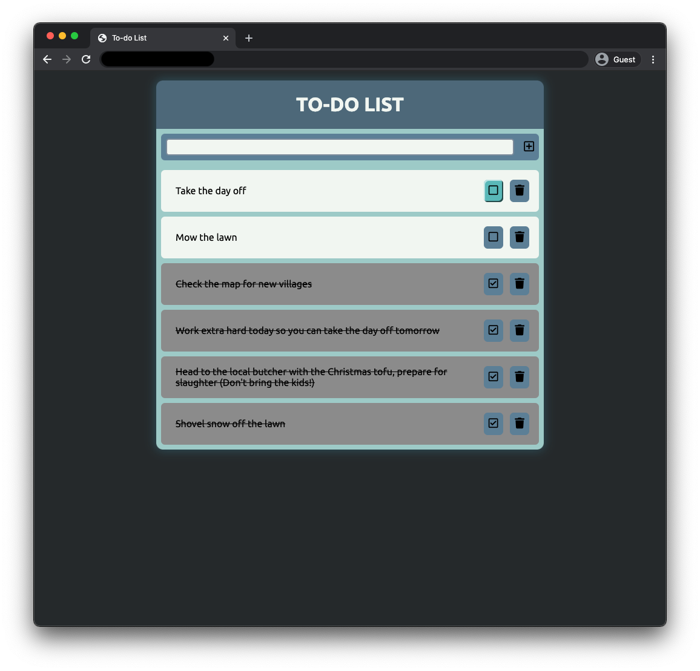
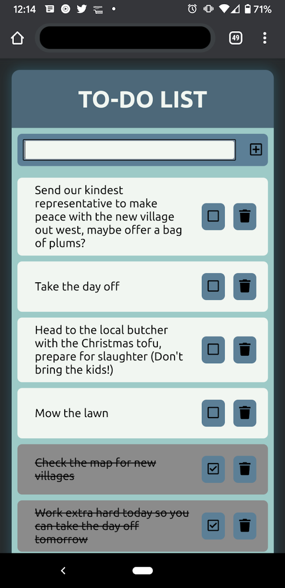

# Weekend SQL To-do List

## Description

_Duration: Weekend Project_

Build a to-do app. Should be able to add todos to a list. Each to-do should have buttons for completing and deleting the to-do.

## Screen Shot

### Prerequisites

- [Node.js](https://nodejs.org/en/)
- [Postgresql](https://www.postgresql.org/)
- [jQuery](https://jquery.com/)
- [Express](https://expressjs.com/)

## Installation

1. Create a database named `weekend-to-do-app`,
2. The queries in the `database.sql` file are set up to create all the necessary tables and populate the needed data to allow the application to run correctly. The project is built on [Postgres](https://www.postgresql.org/download/), so you will need to make sure to have that installed. We recommend using Postico to run those queries as that was used to create the queries, 
3. Open up your editor of choice and run an `npm install`
4. Run `npm start` in your terminal
6. Navigate to [http://localhost:5000/](http://localhost:5000/). App will show up in browser

## Usage
1. Enter a task in the input field and click the +. This will add the todo to the list.
2. Clicking the checkbox and trash buttons will toggle the completion status or delete the todo

## Built With

Node JS
Express
Postgresql
jQuery

## Acknowledgement
Thanks to [Prime Digital Academy](www.primeacademy.io) who equipped and helped me to make this application a reality.

## Support
If you have suggestions or issues, please email me at [jrmicko5012@gmail.com](jrmicko5012@gmail.com)